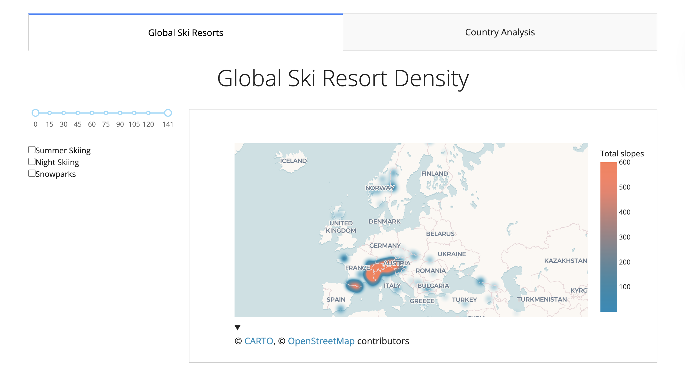

# Interactive Dashboards with Plotly and Dash Coding #

This is a repo for my code when doing the "Interactive Dashboards with Plotly and Dash" by Maven Anlaytics and Chris Bruehl. I learned a lot from this course, increasing my experience within the python sphere. It introduced me to Dash for the first time, which I now prefer over PowerBi or Tableau. I knew some Plotly before but I was not confident in it so this course really helped me improve my abilities and knowledge. 

## Course Learning Objectives ##

- Identify the key components and steps for creating Dash applications.
- Learn about and interpret Plotly Express functions for creating basic charts.
- Discover methods for formatting Plotly Express charts.
- Identify and interpret the functions and use cases for the interactive elements in the Dash Core Components module.
- Learn about the syntax, structure, and components for callback functions in Dash.
- Identify and interpret the syntax for designing app layouts with HTML, markdown, and the Dash Bootstrap Components library.

## Final Project ##

The course include a larger assignment at the end. A mini project to bring all the knowledge learned throughout the course into a dashboard to provide analysis on world wide ski resorts. The data was provided by the course in csv form. It was a fun challenge that reinforced my learning. 

The first tab features a global heat density map for resorts around the globe by total slopes. There also includes some checkboxes and a slider to filter the world map to get more insight. 

The second tab is for a more zoomed in look at each country. The centre piece of this tab is the graph, a bar chart that shows the top 10 resorts in the country by whichever metric the user chooses. The user selects the metric from a dropdown on the side.. To select a country, I have used chained dropdowns where you have to select a continent first. To the right of the bar chart there are some key metrics about certain ski resorts, these are updated using cross-filtering. When you hover over a bar in the main graph the kpis will update.

